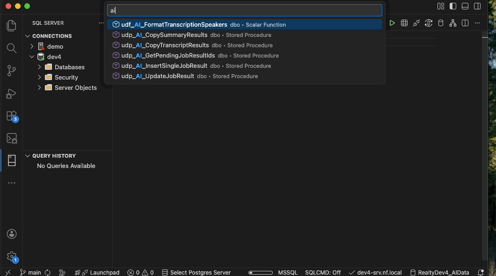

# SQL Search Everywhere



A VS Code extension that enables fast, keyboard-driven search for SQL Server database objects (tables, views, stored procedures, functions). Migrated from Azure Data Studio's SearchEverywhere extension.

## Features

- **Fast Object Search**: Quickly find tables, views, stored procedures, and functions across your SQL Server databases
- **Smart Caching**: Per-database object cache for instant results
- **Configurable Actions**: Customize what happens when you select each type of object
- **Optional Column Display**: Optionally view table columns in search results
- **Keyboard Shortcuts**: Access search instantly with `Ctrl+Shift+;`

## Requirements

- [SQL Server (mssql)](https://marketplace.visualstudio.com/items?itemName=ms-mssql.mssql) extension must be installed
- Active connection to a SQL Server database

## Usage

### Search Database Objects

1. Open a SQL file or connect to a SQL Server database
2. Press `Ctrl+Shift+;` (or `Cmd+Shift+;` on Mac)
3. Type to filter objects
4. Select an object to perform the configured action

### Search with Cache Refresh

Press `Ctrl+Shift+Alt+;` (or `Cmd+Shift+Alt+;` on Mac) to clear cache and search with fresh data.

### Command Palette

- `SQL: Search Database Objects` - Open search
- `SQL: Search Database Objects (Clear Cache)` - Search with cache refresh

## Configuration

### Actions per Object Type

Configure what happens when you select different types of database objects:

```json
{
  "sqlSearchEverywhere.actions.table": "Select",
  "sqlSearchEverywhere.actions.view": "Select",
  "sqlSearchEverywhere.actions.storedProcedure": "Alter",
  "sqlSearchEverywhere.actions.function": "Alter"
}
```

**Available Actions:**

| Action | Description |
|--------|-------------|
| `Select` | Generate `SELECT TOP N` script |
| `Create` | Generate CREATE script from database metadata |
| `Delete` | Generate `DELETE FROM` template (tables only) |
| `Execute` | Generate `EXEC` script (stored procedures only) |
| `Alter` | Generate ALTER script from database |
| `Insert Name` | Insert qualified `[schema].[name]` at cursor |

**Actions per Object Type:**

| Object Type | Available Actions | Default |
|---|---|---|
| Table | `Select`, `Create`, `Delete`, `Insert Name` | `Select` |
| View | `Select`, `Create`, `Alter`, `Insert Name` | `Select` |
| Stored Procedure | `Create`, `Execute`, `Alter`, `Insert Name` | `Alter` |
| Function | `Select`, `Create`, `Alter`, `Insert Name` | `Alter` |

### Column Information

Show column names for tables and views in search results:

```json
{
  "sqlSearchEverywhere.includeTableColumns": false
}
```

**Note:** Enabling this may impact performance on large databases.

### SELECT Row Limit

Configure the number of rows in generated SELECT statements:

```json
{
  "sqlSearchEverywhere.scriptRowLimit": 1000
}
```

## Keyboard Shortcuts


| Shortcut | Action |
|----------|--------|
| `Ctrl+Shift+;` | Search database objects |
| `Ctrl+Shift+Alt+;` | Search with cache clear |

*On Mac, use `Cmd` instead of `Ctrl`*

## Examples

### Scenario 1: Quick SELECT from a Table

1. Press `Ctrl+Shift+;`
2. Type "customers"
3. Select the Customers table
4. Result: `SELECT TOP 1000 * FROM [dbo].[Customers];` is inserted

### Scenario 2: Edit a Stored Procedure

1. Configure: `"sqlSearchEverywhere.actions.storedProcedure": "Alter"` (this is the default)
2. Press `Ctrl+Shift+;`
3. Type "getuser"
4. Select the GetUserById procedure
5. Result: ALTER PROCEDURE script is generated

### Scenario 3: Insert Table Name

1. Configure: `"sqlSearchEverywhere.actions.table": "Insert Name"`
2. Press `Ctrl+Shift+;`
3. Select a table
4. Result: `[dbo].[TableName]` is inserted at cursor

## Comparison with Azure Data Studio Extension

This extension maintains the core functionality of the original Azure Data Studio SearchEverywhere extension while adding:

- ✅ Configurable actions per object type
- ✅ Per-database object caching for fast repeated searches
- ✅ Non-conflicting keyboard shortcuts
- ✅ Improved error handling

## Known Issues

- Column information requires executing a SQL query, which may be slow on large databases

## Development

### Building

```bash
npm install
npm run compile
```

### Testing

1. Press F5 to open Extension Development Host
2. Connect to a SQL Server database
3. Test search commands

## Release Notes

### 1.0.0

- Initial release
- Support for tables, views, stored procedures, and functions
- Configurable actions per object type
- Optional column information display
- Per-database object caching

## License

MIT

## Credits

Migrated from [SearchEverywhere for Azure Data Studio](https://github.com/MikhailProfile/SearchEverywhere)
